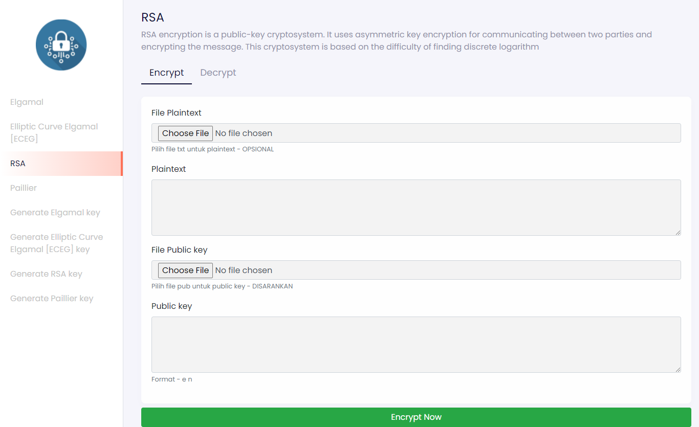
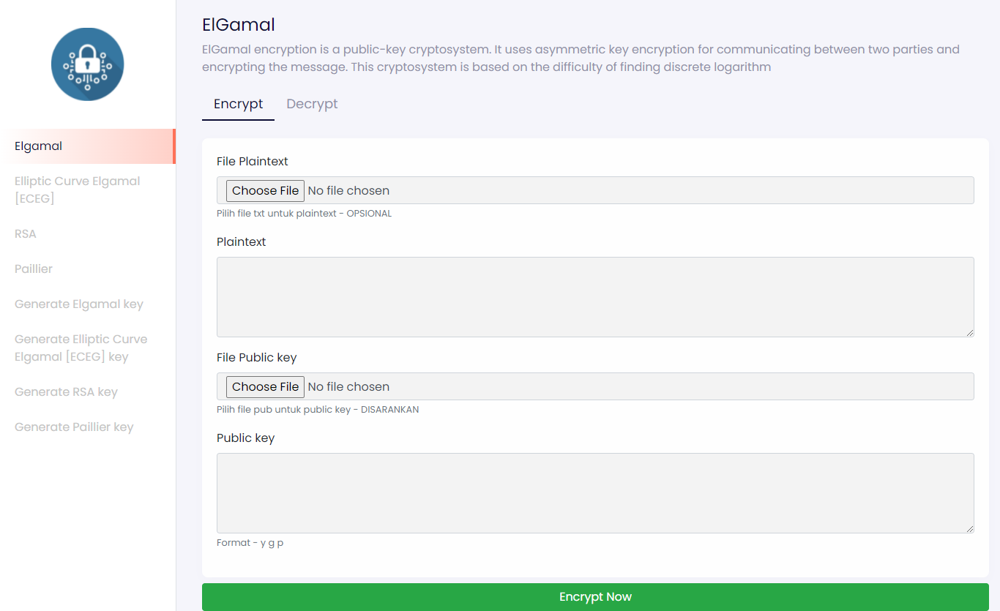
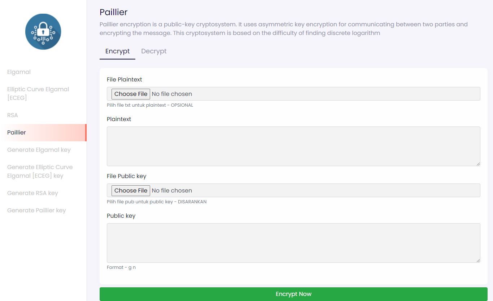
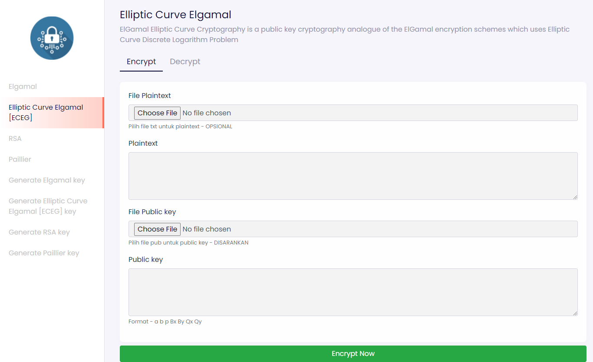

# Modern Cryptography
## Semester I Tahun 2021/2022

### Tugas Kecil IV IF4020 Kriptografi

*Program Studi Teknik Informatika* <br />
*Sekolah Teknik Elektro dan Informatika* <br />
*Institut Teknologi Bandung* <br />

*Semester I Tahun 2021/2022*

## Description
Sebuah program Python yang mengimplementasikan kalkuator enkripsi/dekripsi dengan algoritma RSA, 
ElGamal, Paillier, ECC dengan spesifikasi sebagai berikut:
1. Program terdiri dari:
   1. Pembangkitan kunci privat dan kunci publik yang dapat disimpan dalam file terpisa (misalnya *.pub dan *.pri)
   2. Enkripsi/dekripsi file. Pesan, kunci privat/publik (browing atau diketik nilai kuncinya)
2. Program memiliki editor tempat pengguna mengetikkan pesan atau meng-copy paste teks ke editor tersebut.
3. Program dapat mengenkripsi plainteks dengan RSA, ElGamal, Paillier, ECC
4. Program dapat mendekripsi cipherteks dengan RSA, ElGamal, Paillier, ECC
5. Program dapat menampilkan cipherteks di layer.
6. Tipe integer yang digunakan adalah Long Integer

## Author
1. Reihan Andhika Putra (13519043)
2. Karel Renaldi		    (13519180)

## Requirements
- [Python 3](https://www.python.org/downloads/)

## Installation And Run
Clone the repository
```bash
git clone https://github.com/hokkyss/Stima03_OTOBOT.git
cd src
```
### Automatic Setup
#### First Time Setup
1. Open `setup.bat`
2. Wait until the installation is finished
3. The setup will automatically open the web browser
4. If the page failed to load, wait a moment then refresh the page

#### Run
1. Open `run.bat`
2. It will automatically open the web browser
3. If the page failed to load, wait a moment then refresh the page

#### Manual Setup
After cloning the repository
```bash 
cd src
python -m venv virt
virt\Scripts\activate
pip install -r requirements.txt
python app.py
```
Then open your web browser and go to [localhost:5000](http://localhost:5000)

## Screen Capture 
### RSA


### ElGamal


### Pallier


### ECEG
